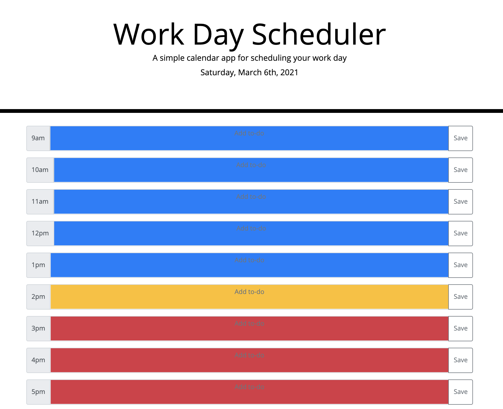

# WorkDayScheduler-assignment5

Go to the Deployed Web Application Here:
https://ladystephani.github.io/WorkDayScheduler-assignment5/

## Description
This assignment is written for Columbia Engineering Coding Bootcamp. The focus is on creating a simple calendar application. The app will run in the browser and will feature dynamically updated HTML and CSS powered by jQuery code. The app allows a user to save events for each working hour of the day, color-coded for blocks in the past, present or future.

## Screenshot View

## Credit
HTML and CSS tarter code credit to the Columbia Coding Bootcamp partnered with Trilogy Education Services, LLC, a 2U, Inc. brand.

jQuery reference courtesy of:*[w3schools](https://www.w3schools.com/).

## License
MIT License

Copyright (c) 2021 ladystephani

Permission is hereby granted, free of charge, to any person obtaining a copy of this software and associated documentation files (the "Software"), to deal in the Software without restriction, including without limitation the rights to use, copy, modify, merge, publish, distribute, sublicense, and/or sell copies of the Software, and to permit persons to whom the Software is furnished to do so, subject to the following conditions:

The above copyright notice and this permission notice shall be included in all copies or substantial portions of the Software.

THE SOFTWARE IS PROVIDED "AS IS", WITHOUT WARRANTY OF ANY KIND, EXPRESS OR IMPLIED, INCLUDING BUT NOT LIMITED TO THE WARRANTIES OF MERCHANTABILITY, FITNESS FOR A PARTICULAR PURPOSE AND NONINFRINGEMENT. IN NO EVENT SHALL THE AUTHORS OR COPYRIGHT HOLDERS BE LIABLE FOR ANY CLAIM, DAMAGES OR OTHER LIABILITY, WHETHER IN AN ACTION OF CONTRACT, TORT OR OTHERWISE, ARISING FROM, OUT OF OR IN CONNECTION WITH THE SOFTWARE OR THE USE OR OTHER DEALINGS IN THE SOFTWARE.
